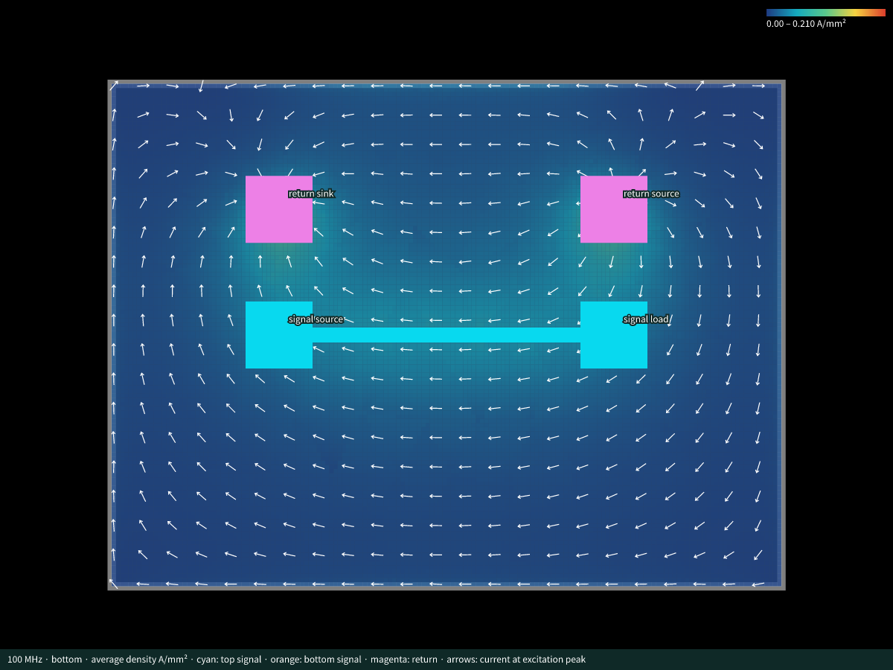
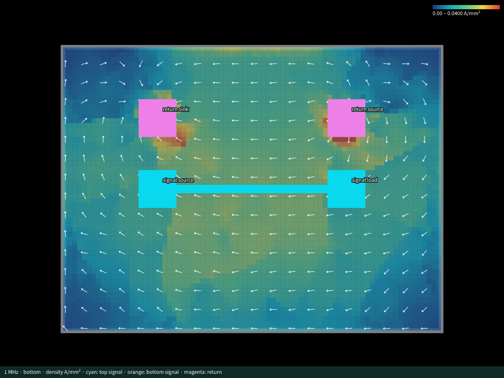

# Circuit JSON return-current integration fixtures

## TSX-authored experiment with explicit return contacts

The [TSX-to-EM example](tsx-explicit-ports-100mhz/) declares the experiment and separate driver/load GND contacts in TSX, then runs the existing CLI at 100 MHz. It includes the actual result, PCB overlay, solver evidence, and portable reproduction steps using the proposed core and props packages.

## Latest: 100 MHz with 0.05 mm cells

The latest snapshot uses a completed **Palace v0.14.0, 100 MHz, 5 mA peak** EM run on the same two-layer PCB, with the same separate signal/GND terminals and 25/100 Ω ports. Sampling cells were reduced from 0.1 mm to **0.05 mm**, giving a 160 × 120 grid. The FEM mesh target is 1 mm with second-order elements: 45,493 tetrahedra and 314,698 unknowns.



The copper model is explicitly finite-conductivity **surface impedance**. At 100 MHz the unchanged 35 µm foil and via plating are about 5.3 skin depths thick. Palace solves the Maxwell fields in air/substrate and models the copper's frequency-dependent surface impedance. The stored complex sheet current sums the actual exposed foil-face currents and is normalized to the declared 5 mA source. No volumetric skin-depth mesh is claimed.

The 19,176 finite conductor cells and 24 drill voids pass the official Circuit JSON schemas. Input impedance is approximately **100.01625 + j0.391499 Ω**. Input/load average power is 1.250203 / 1.249167 mW. The physical geometry, material properties and resolved source/load contacts are documented in `explicit-port-100mhz.validation.json`, with actual configuration, completion log, terminal CSVs and surface-sampling receipts in `explicit-port-100mhz.evidence/`.

The result file, `explicit-port-100mhz.result.circuit.json`, contains portable embedded gzip field data and a PNG heatmap. The preview uses a full-range 0–0.21 A/mm² scale and shows arrows at the excitation's positive-current peak; no phase-angle option is needed. Density is the equivalent foil average, not the local maximum in the copper skin layer. Near-edge, via-wall and local-density convergence has not been established. The earlier 1 MHz model/resolution differ, so these are integration fixtures rather than a controlled frequency comparison.

Reproduce the latest run and render it with:

```sh
bun run simulate:circuit-json examples/circuit-json/explicit-port-100mhz.input.circuit.json \
  --experiment-id simulation_experiment_explicit_port_100mhz \
  --frequency-hz 100000000 --copper-model surface_impedance \
  --sample-layer bottom --cell-size 0.05 --mesh-size 1 --order 2 \
  --air-padding 2 --processes 4 --output work/explicit-port-100mhz \
  --result-json work/explicit-port-100mhz.result.circuit.json \
  --result-id simulation_pcb_return_current_result_explicit_port_100mhz

bun run render:simulation work/explicit-port-100mhz.result.circuit.json \
  --simulation-result-id simulation_pcb_return_current_result_explicit_port_100mhz \
  --layer bottom --vectors --density-range 0,0.21 \
  --output work/explicit-port-100mhz.overlay.svg
```

Run from the repository root. See [setup instructions](../../scripts/circuit-json/README.md) for Python and Palace prerequisites.

## Earlier: 1 MHz volumetric-copper fixture

This small two-layer board exercises the CLI and renderer with a **real Palace v0.14.0 EM run**. It is a workflow fixture, separate from the AM3352 DDR results. Its coarse first-order mesh has not been converged for engineering accuracy.



Files:

- `explicit-port-1mhz.board.circuit.json`: PCB geometry generated by `@tscircuit/core`, without simulation definitions.
- `explicit-port-1mhz.input.circuit.json`: the same board with official `simulation_experiment` and `simulation_return_current_excitation` definitions, without results.
- `explicit-port-1mhz.result.circuit.json`: the complete board, definitions, result, complex field, heatmap, and four terminal markers. Gzipped field JSON and transparent PNG are embedded data URLs, so this file is portable without a sidecar asset folder.
- `explicit-port-1mhz.overlay.svg` / `.png`: actual result rendered through the local `circuit-to-svg` prototype wrapper, including the PCB, selected terminals, and phase arrows.
- `explicit-port-1mhz.validation.json`: run parameters, measured quantities, validation checks, and hashes.
- `explicit-port-1mhz.evidence/`: compact actual Palace configuration, model, mesh counts, solve log, and raw terminal voltage/current CSVs.

The stable experiment ID is `simulation_experiment_explicit_port_1mhz`; the result ID is `simulation_pcb_return_current_result_explicit_port_1mhz`.

## Physical fixture

An 8 × 6 mm, 0.8 mm thick FR4 board carries a 4 mm, 0.18 mm wide top-layer trace from **U1.OUT** to **U2.IN**. Actual separate **U1.GND** and **U2.GND** pads connect through concentric plated vias to the bottom GND plane. Source and load signal/reference terminals therefore do not share a pad or x/y position.

The run uses 1 MHz, **5 mA peak** in-phase source current, a 25 Ω source reference resistance, and a 100 Ω load. Copper is 0.035 mm thick with conductivity 5.8 × 10⁷ S/m; FR4 has εᵣ = 4.3 and tan δ = 0.02. Air padding is 2 mm, mesh target 2 mm, FEM order 1, and sampling pitch 0.1 mm. This low frequency satisfies the current two-layer volume-mesher skin-depth restriction. It does not represent a DDR operating condition.

PR887 experiment definitions do not yet include a frequency configuration field. Both input modes therefore take the requested frequency explicitly from `--frequency-hz`; the actual result records it as `frequency_hz`.

## Run the pending definition

From the repository root, after installing the prototype prerequisites:

```sh
bun scripts/circuit-json/simulate-return-current.ts \
  examples/circuit-json/explicit-port-1mhz.input.circuit.json \
  --experiment-id simulation_experiment_explicit_port_1mhz \
  --frequency-hz 1000000 --cell-size 0.1 --mesh-size 2 \
  --order 1 --air-padding 2 --processes 4 \
  --output work/circuit-json-explicit-ports \
  --result-json work/explicit-port-1mhz.result.circuit.json \
  --result-id simulation_pcb_return_current_result_explicit_port_1mhz \
  --field-format gzip
```

Provide `--python /path/to/python` when using an existing Gmsh/VTK environment. The checked run used `/workspace/work/em-venv/bin/python` and the pinned Docker Palace image recorded in the validation JSON. Raw FEM volume output and mesh files remain in the requested run directory rather than the portable result file.

## Define the same experiment with flags

```sh
bun scripts/circuit-json/simulate-return-current.ts \
  examples/circuit-json/explicit-port-1mhz.board.circuit.json \
  --source U1.OUT --source-reference U1.GND \
  --load U2.IN --load-reference U2.GND \
  --ground GND --current 5mA \
  --source-impedance 25 --load-impedance 100 \
  --experiment-id simulation_experiment_explicit_port_1mhz \
  --frequency-hz 1000000 --cell-size 0.1 --mesh-size 2 \
  --order 1 --air-padding 2 --processes 4 \
  --output work/circuit-json-explicit-ports-flags \
  --result-json work/explicit-port-1mhz.flags-result.circuit.json \
  --result-id simulation_pcb_return_current_result_explicit_port_1mhz \
  --field-format gzip
```

Add `--prepare-only` to validate and resolve this second input without another EM solve. This was checked: the resolved physical models from flags and predeclared definitions are identical except for the generated excitation ID.

## Render the stored result

```sh
bun scripts/circuit-json/render-return-current.ts \
  examples/circuit-json/explicit-port-1mhz.result.circuit.json \
  --simulation-result-id simulation_pcb_return_current_result_explicit_port_1mhz \
  --layer bottom --vectors --density-range 0,0.04 \
  --output work/explicit-port-1mhz.overlay.svg
```

The preview uses an explicit 0–0.04 A/mm² density scale. The renderer receives the selected result ID and uses the embedded field alongside the real PCB geometry. Values are sheet current in **A/mm**, row-major from bottom-left, with peak complex phasors using exp(+jωt). The four field channels share the same conductor mask; `null` cells are nonconductors, not zero-current copper.

## Checked evidence and limits

Palace converged on 35,018 tetrahedra. The 80 × 60 grid contains 4,792 finite complex conductor cells and exactly eight masked cells covering the two via drills. All simulation records and decoded grid data pass the official `circuit-json@0.0.522` schemas; all simulation references resolve, and both field and image assets are self-contained.

The normalized source current is 5 mA peak. Input average power is 1.250153 mW, load power is 1.249988 mW, and input impedance is approximately 100.0122 − j0.00292 Ω. Voltage and current CSVs retain the original Palace normalization; the validation JSON gives quantities after applying the declared 5 mA source normalization.

A sampled cross-section returns approximately 4.21 mA instead of 5 mA, a **16% discrepancy** on this intentionally coarse mesh. This checks data flow and units; mesh/order/domain convergence is still required for reliable absolute local current density. Numeric component display offsets emitted by the released core were normalized to Circuit JSON string display offsets; PCB geometry and simulation definitions were retained.
