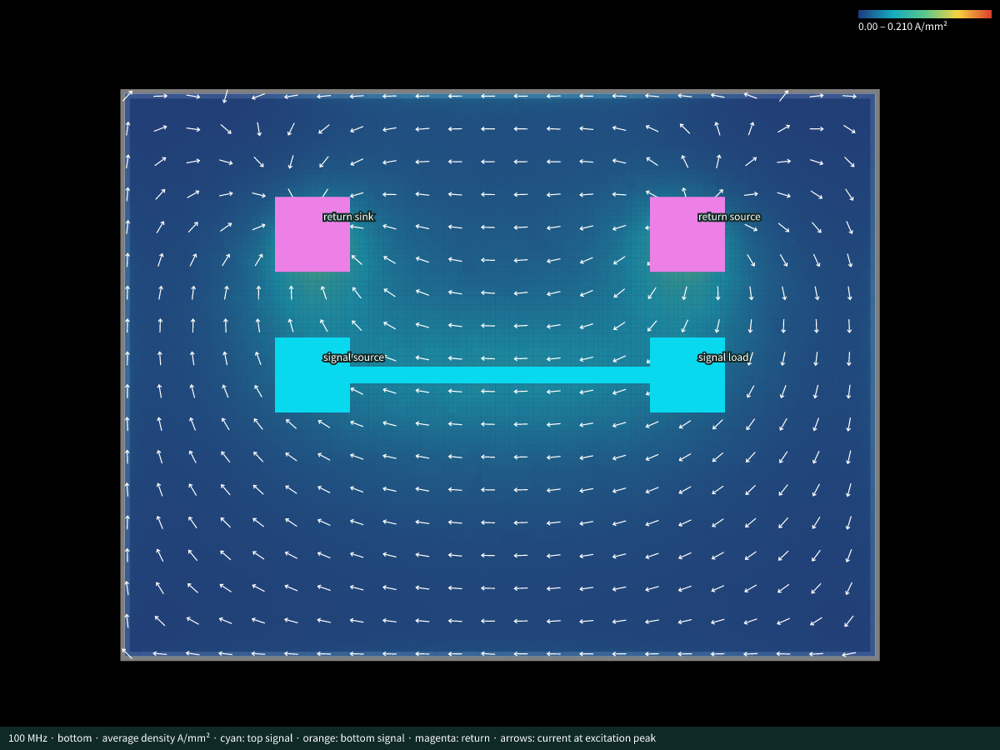

# TSX declaration → Circuit JSON → 100 MHz EM result

This example archives a completed **Palace v0.14.0, 100 MHz, 5 mA peak** run authored with TSX. Rendering the TSX creates the PCB and pending official simulation definitions. The separate CLI then runs EM and adds portable results to that Circuit JSON.



The 8 × 6 mm two-layer PCB has a 4 mm top-layer signal trace between `U1.OUT` and `U2.IN`. Separate `U1.GND` and `U2.GND` pads connect through plated vias to the bottom GND plane. The declaration uses the load-side GND pad as `returnSource` at **(2, 1.5) mm** and the driver-side GND pad as `returnSink` at **(−2, 1.5) mm**:

```tsx
import { Circuit, simulation } from "@tscircuit/core"

<simulation.pcbreturncurrentsimulation name="Explicit GND terminals: TSX 5 mA">
  <simulation.pcbreturncurrentexcitation
    name="U1 OUT to U2 IN"
    source=".U1 > .OUT"
    load=".U2 > .IN"
    ground="net.GND"
    current="5mA"
    returnSource=".U2 > .GND"
    returnSink=".U1 > .GND"
    sourceImpedance="25ohm"
    loadImpedance="100ohm"
  />
</simulation.pcbreturncurrentsimulation>
```

These JSX elements declare an experiment; they do not launch the solver during `renderUntilSettled()`. See [generate-input.tsx](generate-input.tsx) and the unchanged [ExplicitPortBoard.tsx](ExplicitPortBoard.tsx) geometry for the complete source. Via-in-pad GND contacts and copper reaching the board edge are intentional in this EM fixture. Its authoring script enables via-in-pad and disables manufacturing DRC without changing the copper geometry.

## Archived output and validation

- [input.circuit.json](input.circuit.json): the TSX-generated board plus pending experiment/excitation, with no results.
- [result.circuit.json](result.circuit.json): the original board, definitions, result, embedded gzip complex field, PNG heatmap, and four terminal markers. No external field assets are required.
- [authoring-validation.json](authoring-validation.json): selector resolution, distinct signal/GND ports, 5 mA excitation, and 25/100 Ω impedances.
- [integration-validation.json](integration-validation.json): actual run provenance, hashes, schema checks, and exact exported-field comparison with the completed FEM reference.
- [evidence/](evidence/): byte-preserved actual model, Palace configuration/completion log, mesh counts, source-current normalization, surface-sampling receipt, timing, and raw terminal voltage/current CSVs. [cli.log](cli.log) records the original command. Absolute paths in these historical logs describe the original run; the public source below has no private runtime imports.
- [overlay.svg](overlay.svg) / [overlay.png](overlay.png): the actual result rendered over its PCB. The PNG is a direct rasterization of that SVG.

All **nine** simulation records pass the official Circuit JSON schemas. The embedded **160 × 120**, **0.05 mm** grid contains **19,176** finite complex conductor cells and **24** drill-void cells masked with `null` in every channel. All 19,176 vectors exactly match the actual sampled FEM reference, terminal references resolve, and the normalized source current is **5 mA + j0**. The physical geometry matches the earlier explicit-port 100 MHz fixture. The new run used **45,699 tetrahedra**, **315,990 second-order unknowns**, and converged its linear solve in **15 GMRES iterations**.

The preserved result SHA-256 is `206af84e145dd73738bac6b43f89cf36572c65665d87d8e8eb75e8638f9f1337`. Input and model hashes are recorded in the integration receipt; raw mesh/FEM volume files are omitted from this compact archive.

## Reproduce with the unreleased previews

The TSX API is proposed in draft core PRs [#4459](https://github.com/tscircuit/core/pull/4459) and [#4460](https://github.com/tscircuit/core/pull/4460), using props PR [#926](https://github.com/tscircuit/props/pull/926). It requires the **unreleased** [core `3eff6a6` preview](https://pkg.pr.new/tscircuit/core/@tscircuit/core@3eff6a6) and [props `0dcdae1` preview](https://pkg.pr.new/tscircuit/props/@tscircuit/props@0dcdae1), pinned in this folder's `package.json`. The archived receipts identify the commits used for the original EM run. A stable npm release is not assumed to support these JSX elements yet.

From the repository root, install the example's preview packages and generate a fresh pending input outside the checked archive:

```sh
bun install --cwd examples/circuit-json/tsx-explicit-ports-100mhz
bun examples/circuit-json/tsx-explicit-ports-100mhz/generate-input.tsx \
  work/tsx-explicit-ports-100mhz
```

Regeneration with these public previews and namespaced declarations preserves every PCB and simulation element in the archived input. The only change is the core software-version metadata, from `0.0.2114` to `0.0.2117`. The authoring validation receipt is byte-identical; the archived input, EM result, and solver evidence remain preserved.

Follow the [CLI setup instructions](../../../scripts/circuit-json/README.md) for Python/Gmsh/VTK and Docker Palace. Then run from the repository root:

```sh
bun run simulate:circuit-json work/tsx-explicit-ports-100mhz/input.circuit.json \
  --experiment-id simulation_experiment_0 \
  --frequency-hz 100000000 --copper-model surface_impedance \
  --sample-layer bottom --cell-size 0.05 --mesh-size 1 --order 2 \
  --air-padding 2 --processes 4 \
  --output work/tsx-explicit-ports-100mhz/run \
  --result-json work/tsx-explicit-ports-100mhz/result.circuit.json \
  --result-id simulation_pcb_return_current_result_tsx

bun run render:simulation work/tsx-explicit-ports-100mhz/result.circuit.json \
  --simulation-result-id simulation_pcb_return_current_result_tsx \
  --layer bottom --vectors --density-range 0,0.21 \
  --output work/tsx-explicit-ports-100mhz/overlay.svg
```

Use `--python /path/to/venv/bin/python` to reuse an existing Python environment. To inspect the completed result without another solve, pass this folder's `result.circuit.json` directly to the render command. Frequency is explicit in the CLI because the pending experiment schema has no frequency field; the completed result records `frequency_hz: 100000000`.

## EM model and limits

The run explicitly opts into **finite-conductivity surface impedance**, retaining 35 µm copper foil/plating and conductivity 5.8 × 10⁷ S/m. At 100 MHz those thicknesses are about 5.3 skin depths. Palace solves Maxwell fields in air/substrate with copper surface impedance; the copper skin layer is not volumetrically meshed. FR4 uses εᵣ = 4.3 and tan δ = 0.02.

The field sums complex tangential current from the actually exposed horizontal foil faces in **A/mm**, normalized to the declared peak source current. At via junctions only one foil face can be exposed; the sampling receipt records 19,152 two-face cells and 24 one-face cells. The overlay displays **|sheet current| / 0.035 mm** in **A/mm²**, an equivalent foil-average density, and arrows at the excitation's positive-current peak. It does not show local skin-layer or via-barrel current density.

This is an integration check, not a mesh/order/domain convergence study. Smaller sampling cells do not establish FEM accuracy. Local edge, contact, and via-density convergence has not been demonstrated; the unstructured mesh differs from the earlier fixture, so this archive is not a controlled frequency comparison.
