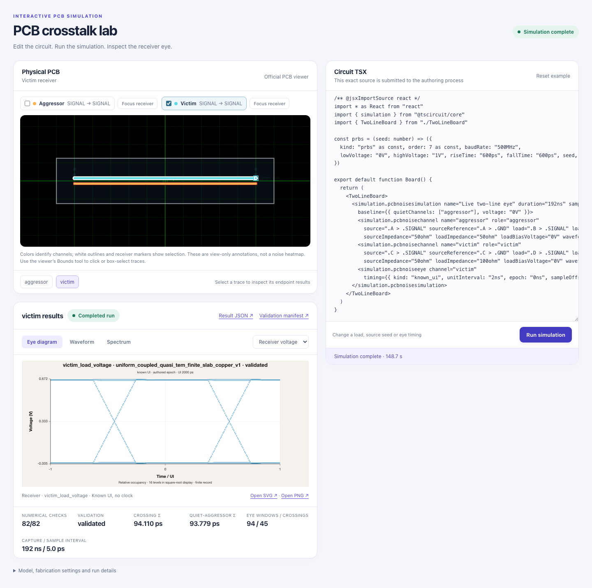
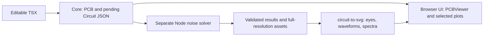

# Live PCB crosstalk demo

Actual [tscircuit PCBViewer](https://github.com/tscircuit/pcb-viewer) on the left, editable TSX on the right, and a **Run simulation** button. Each click authors the submitted source and starts a separate Node solver process. Results appear beside the selected trace; no simulation results are embedded in the page.



## Run locally

Use Bun 1.3.14 or newer and Node 24. From `examples/circuit-json/two-line-pcb-noise`:

```sh
bun install --frozen-lockfile
bun run dev
```

Open **http://127.0.0.1:3077**. `PCB_NOISE_NODE` can select another Node executable. Runs take roughly 1–3 minutes; stage and elapsed time reflect the real job. Use **Cancel** to stop it.

## Demo it

1. Select **Victim** and click **Run simulation**. Inspect its receiver eye, waveform and spectrum.
2. Change the victim channel's `loadImpedance="50ohm"` to `"100ohm"`. Existing results are marked stale. Run again to see a newly computed response.
3. Select the aggressor or both traces; the highlights follow the actual viewer's pan and zoom. Use the viewer's Bounds tool for a physical trace selection.

The eye can use a known 2 ns symbol interval without a clock. The alternative authored symbol clock is a nominal reference. [Complete compact TSX](https://github.com/tscircuit/props/pull/927) shows channels, contacts, source/load values and timing.

## What runs



Core resolves the actual signal/reference contacts. The solver computes total, quiet-aggressor baseline and their difference. Plotting reads the saved numerical assets. Trace colors identify channels and selection; voltage/current plots describe their contacts, without claiming a spatial noise field.

Fresh runs and their submitted source, materials/settings, input/result Circuit JSON, process records, logs and SVG/PNG assets are preserved under `work/interactive/`. The page links to the result and manifest. Only a numerically validated run can be shown as completed; invalid TSX and unsupported geometry produce errors.

## PR structure

The solver and visual README are merged in [simulate-pcb-noise](https://github.com/tscircuit/simulate-pcb-noise). These accompanying PRs remain separate:

| PR | Role |
| --- | --- |
| [circuit-json #895](https://github.com/tscircuit/circuit-json/pull/895) | Shared experiments, result/asset schemas and validation |
| [props #927](https://github.com/tscircuit/props/pull/927) | Compact channel and eye TSX props; stacked on #926 |
| [core #4472](https://github.com/tscircuit/core/pull/4472) | TSX to physical pending inputs; stacked on #4460 |
| [circuit-to-svg #820](https://github.com/tscircuit/circuit-to-svg/pull/820) | Eye, waveform, spectrum and contact plots |
| [demo #1](https://github.com/tscircuit/return-current-trace-demo/pull/1) | Reproducible four-case command-line example |
| [demo #2](https://github.com/tscircuit/return-current-trace-demo/pull/2) | Browser UI and real background-run orchestration; stacked on demo #1 |
| [simulate-return-current #17](https://github.com/tscircuit/simulate-return-current/pull/17) | Supporting native provenance/meshing fixes |
| [native crosstalk #4](https://github.com/tscircuit/circuit-json-crosstalk-simulation/pull/4) | Import archived native artifacts while retaining their unvalidated status |

The last two support native workflows and are outside this demo's solver path. Upstream authoring PRs are not included in this list. The demo uses verified immutable package previews while these APIs await stable publication.

## Scope and checks

This provider models two straight, equal-width parallel traces over ideal ground, with explicit dielectric and copper properties. Arbitrary routing, finite-ground impedance, PCB-derived supply noise and calibrated hardware accuracy remain outside this model.

```sh
bun run typecheck
bun run build:interactive
bun run test:interactive
```

All execution and verification are local. This demo adds no GitHub Actions workflows.
