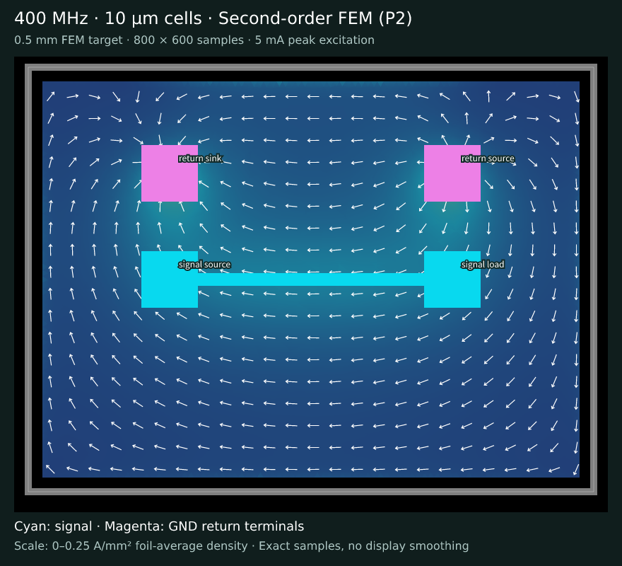
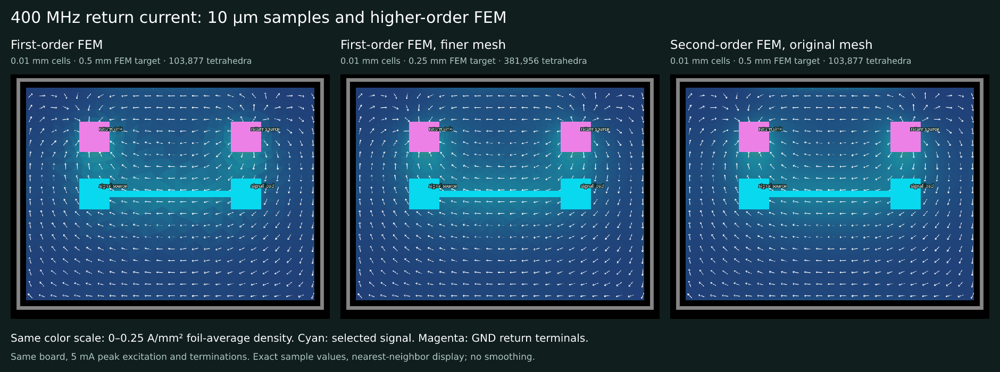

# 400 MHz, 10 µm sampling and second-order FEM



All views use 0.01 mm (10 µm) cells: an 800 × 600 grid with 424,968 conductor samples and 55,032 genuine masked cells. This is 6.25 times as many samples as the previous 0.025 mm grid. The two-layer board, 5 mA peak source, 25 Ω / 100 Ω terminations, 35 µm copper, surface-impedance copper model and bottom GND return layer are unchanged.



| View | FEM target | Order | Tetrahedra |
| --- | --- | --- | --- |
| [First-order baseline](first-order.png) | 0.5 mm | P1 | 103,877 |
| [Finer first-order mesh](finer-mesh.png) | 0.25 mm | P1 | 381,956 |
| [Second-order field](second-order.png) / [SVG](second-order.svg) | 0.5 mm | P2 | 103,877 |

The P1 and P2 0.5 mm cases use byte-identical Gmsh meshes. P1's surface-current field is effectively constant inside each triangle. P2's actual exported six-node elements retain variation within each triangle; the sampler evaluates those elements. This substantially reduces the flat patches, although discontinuities at element boundaries can remain.

Each PNG pixel represents a stored complex-field sample. All figures use the same circuit-to-svg palette and linear 0–0.25 A/mm² foil-average density range; no samples exceed that scale. PCB traces, actual return terminals and current arrows are rendered by circuit-to-svg. Images use nearest-neighbor display, without cross-cell smoothing or filling masked cells.

Use the TSX board from the [merged CLI test](https://github.com/tscircuit/cli/blob/c16ebbcc1905f33fd547e7a395749d973fb69be9/tests/cli/simulate/return-current.test.ts) as `board.circuit.tsx`:

```sh
tsci simulate return-current board.circuit.tsx --frequency-hz 400000000 --copper-model surface_impedance_copper --sample-layer bottom --cell-size 0.01 --mesh-size 0.5 --order 2 --air-padding 2 --processes 1 --output em --result-json result.circuit.json
```

The 0.5 mm/P2 run completed through the CLI with Palace v0.14.0, GMRES tolerance 1e-9 and its default SuperLU coarse preconditioner. It converged in 14 iterations. The 0.25 mm/P1 direct solve exceeded the 16 GiB memory limit; the same generated mesh/model was rerun using the [recorded AMS configuration](palace-ams.json), with the same physical Maxwell operator and tolerance. That run converged in 71 iterations, followed by the public `resamplePalaceCase` and Circuit JSON exporter. AMS settings affect preconditioning, not the solved physical model.

All cases pass raw provenance, masking, 5 mA normalization and positive-power checks. The mesh refinement changes sampled current magnitudes by 10.35% RMS; P1→P2 changes them by 9.35% RMS. Numerical mesh convergence is not established. Smoother images alone do not establish absolute accuracy.

`provenance.json` records model/mesh/configuration/reference hashes, actual solver settings, masks and display receipts. Simulator package: `https://pkg.pr.new/tscircuit/simulate-return-current@6a7c84cb4f9f66c2cb54199aee50d3c7453748e8`; circuit-to-svg 0.0.447. Large native outputs and Circuit JSON field assets are kept out of this image comparison.
