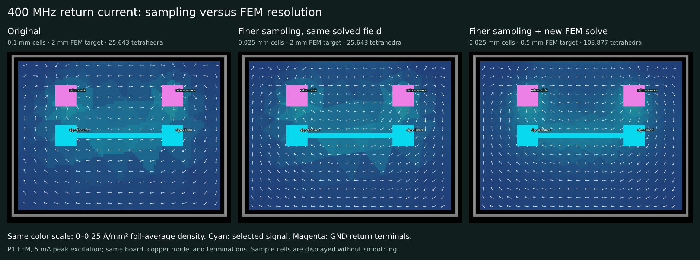

# 400 MHz sampling and FEM resolution comparison



These figures use the real Palace solution of the small two-layer board from the [merged CLI integration test](https://github.com/tscircuit/cli/blob/c16ebbcc1905f33fd547e7a395749d973fb69be9/tests/cli/simulate/return-current.test.ts). The board, copper, terminal selections, 5 mA peak source, 25 Ω source impedance, 100 Ω load impedance, 2 mm air padding, and FEM order 1 are unchanged. The sampled return layer is bottom.

| View | Sample pitch | FEM target | Grid | Tetrahedra |
| --- | --- | --- | --- | --- |
| [Original](original.png) | 0.1 mm | 2 mm | 80 × 60 | 25,643 |
| [Finer sampling](finer-cells.png) | 0.025 mm | 2 mm | 320 × 240 | 25,643 |
| [Finer mesh](finer-mesh.png) | 0.025 mm | 0.5 mm | 320 × 240 | 103,877 |

The middle image resamples the original completed FEM solve; it does not rerun or change the physics. The right image comes from a fresh FEM solve. All views use the same linear density scale, 0–0.25 A/mm², for through-thickness average density. They use circuit-to-svg's PCB overlay. Sample-cell rectangle edges use `shape-rendering="crispEdges"` to avoid translucent antialias seams; the field is not smoothed or interpolated between cells.

To run the refined case, extract the TSX board from the linked test into `board.circuit.tsx`, then use a CLI build containing the merged command with Python/Gmsh/VTK and Palace/Docker installed:

```sh
tsci simulate return-current board.circuit.tsx --frequency-hz 400000000 --copper-model surface_impedance_copper --sample-layer bottom --cell-size 0.025 --mesh-size 0.5 --order 1 --air-padding 2 --processes 1 --output em --result-json result.circuit.json
```

Render the result with `convertCircuitJsonToPcbSimulationSvg`, selecting its result ID and `layer: "bottom"`, with `returnCurrent: { showVectors: true, densityRange: { min: 0, max: 0.25 } }`. The simulator package is the immutable preview `https://pkg.pr.new/tscircuit/simulate-return-current@6a7c84cb4f9f66c2cb54199aee50d3c7453748e8`; circuit-to-svg is 0.0.447 and Palace is v0.14.0.

The sharp facets partly come from the P1 surface-current field being effectively constant within each FEM triangle. Smaller sample cells show those triangles more faithfully. The 0.5 mm target reduces the largest ground-face triangle edges from about 1.4 to 0.51 mm. The targets are background mesh settings; local features are already refined below those sizes.

Both solves converge algebraically, but mesh convergence is not established: the sampled current magnitudes differ by 21.6% RMS between the two meshes. A finer mesh or higher FEM order should be assessed before treating absolute current densities as settled. `provenance.json` records the native input, model, mesh, normalization and reference hashes without committing the large solver outputs.
